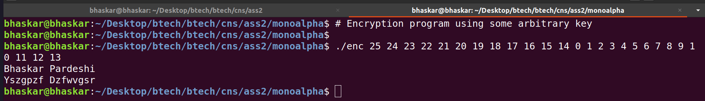

# Substitution Cipher

### Caesar cipher

#### Explanation

* The Caesar cipher program implemented is capable of encryption and decryption of
  lowercase and uppercase alphabets, rest all characters in the input string are
  left as they were originally.
* An integer key is to be provided which indicates the offset from plaintext alphabet
  to ciphertext alphabet.
* The code for Caesar cipher has two library files - **caesar.c** and **caesar.h**,
  for implementing the basic routines of encryption, decryption and brute force
  decryption using the semantics of Caesar cipher.
* Two seperate programs for encrypting and decrypting - **encrypt.c** and **decrypt.c**
  are implemented, for user access, wherein both of these programs utilise the
  library files discussed above.
* Both the programs take the key as a command line argument. Also the encryption program
  takes the plaintext to be encrypted from the standard input and prints the encrypted
  ciphertext to the standard output. And the decryption program takes the ciphertext
  to be decrypted from the standard input and prints the decrypted plaintext to the
  standard output.

#### Program output

### Monoalphabetic cipher

#### Explanation

* The Monoalphabetic cipher program implemented is capable of encryption and decryption of
  lowercase and uppercase alphabets, rest all characters in the input string are
  left as they were originally.
* An integer key table of 26 elements, where each number is (mod 26) and no element is
  repeated is to be provided to the program, which indicates the mapping from the plaintext
  character number to the ciphertext character number.
* The code for Monoalphabetic cipher has two library files - **monoalpha.c** and **monoalpha.h**,
  for implementing the basic routines of encryption, decryption and brute force
  decryption using the semantics of Monoalphabetic cipher.
* Two seperate programs for encrypting and decrypting - **encrypt.c** and **decrypt.c**
  are implemented, for user access, wherein both of these programs utilise the
  library files discussed above.
* Both the programs take the key table as a command line argument. Also the encryption program
  takes the plaintext to be encrypted from the standard input and prints the encrypted
  ciphertext to the standard output. And the decryption program takes the ciphertext
  to be decrypted from the standard input and prints the decrypted plaintext to the
  standard output.
* If the input key table is invalid, then the output string is empty.

#### Program output

